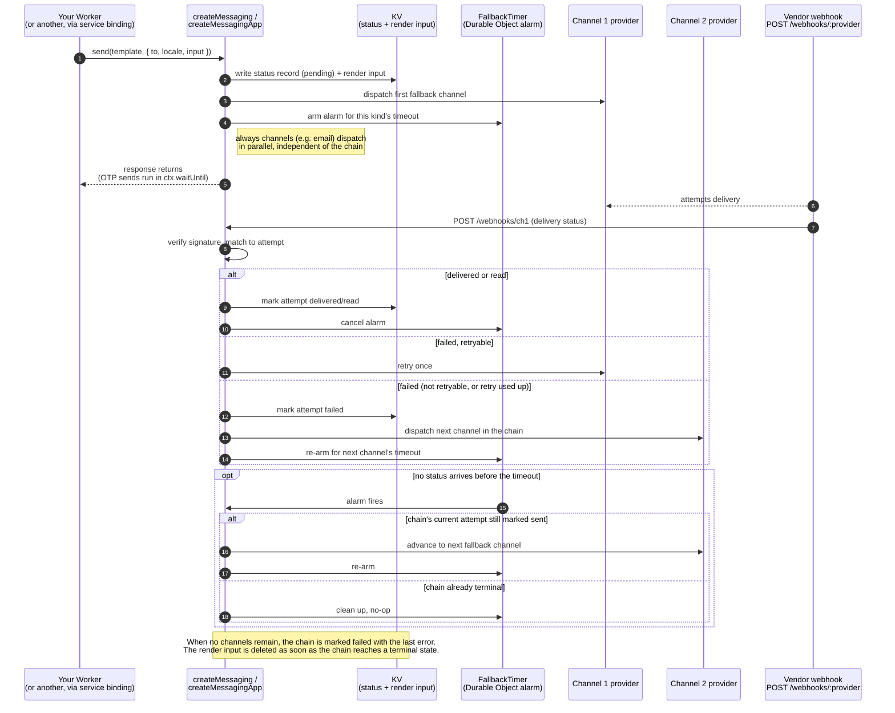

# messagefall-workers

Outbound messaging for Cloudflare Workers. Send over a chain of channels (WhatsApp, SMS, email, in whatever order you configure) and fall back to the next one when delivery fails or times out, send other channels alongside the chain, define templates once with typed inputs, receive delivery-status webhooks, and let other Workers send through a service binding.

The name is the feature: a message _falls_ from one channel to the next in the order you configure, driven by real delivery status rather than hope.

It is deliberately small. Every provider, including WhatsApp, is a plugin behind one contract: a `send` function and, if the provider reports delivery, a webhook handler. Built-in providers cover the common vendors; a local SMS gateway is ten lines. State lives in KV, with an optional Durable Object for timed fallback. Nothing runs outside your Worker.

> **Status:** `0.2.0`. See the [CHANGELOG](CHANGELOG.md) for what it contains. It is not published to npm; each release is a tarball on its GitHub Release (see [Installation](#installation)). The API may still change in a `0.x` line.

## Contents

- [Features](#features)
- [Installation](#installation)
- [Quick start](#quick-start)
- [How delivery works](#how-delivery-works)
- [Templates](#templates)
- [Providers](#providers)
- [One-time codes](#one-time-codes)
- [Delivery status](#delivery-status)
- [Sending from another Worker](#sending-from-another-worker)
- [Configuration](#configuration)
- [Routing and webhooks](#routing-and-webhooks)
- [Local development](#local-development)
- [Compatibility](#compatibility)
- [FAQ](#faq)
- [Contributing](#contributing)
- [License](#license)

## Features

- **Configurable fallback chain** across WhatsApp, SMS and email, in whatever order you set, triggered by a failed delivery status or by a timeout you configure per message kind.
- **Always-on channels** that send in parallel with the fallback chain, for example email with every message.
- **Delivery policy at three levels**: a default, a per-template override, and a per-send override, including "every channel this template defines".
- **Email** as a channel with the same template and provider contract.
- **Typed templates**: define a message once with an input schema and per-channel renderings, including Meta template names and parameters. Sending a template with the wrong input is a type error.
- **Pluggable providers.** One contract for WhatsApp, SMS and email. The first release ships Meta Cloud API for WhatsApp, a generic HTTP gateway for SMS, Gmail for email, and a console provider for development. More vendors follow as separate entry points.
- **Provider-owned webhooks.** Each provider that reports delivery verifies and parses its own status callbacks at `/webhooks/<provider>`, and the package correlates them back to the send.
- **Delivery-status store in KV** with a TTL, queryable by message id.
- **Timed fallback through a Durable Object alarm**, optional. Without it, fallback still happens on a failed status.
- **`createMessagingClient`** for other Workers: send over a service binding with the same typed template catalog.
- **No message bodies in logs**, enforced in code.
- Typed `Env` so a missing binding is a type error.

## Installation

Not on npm. Every release attaches a built tarball to its
[GitHub Release](https://github.com/nalinda/messagefall-workers/releases); install
it by URL, which pins the exact version and needs no build step:

```sh
bun add messagefall-workers@https://github.com/nalinda/messagefall-workers/releases/download/v0.2.0/messagefall-workers-0.2.0.tgz
```

`npm install <url>` and `pnpm add <url>` work the same way. Installing from a git
URL does not: the entry points resolve into `dist/`, which is not committed.

No other runtime dependencies. Hono is an optional peer dependency for the ready-made app.

## Quick start

A Worker that sends WhatsApp with SMS fallback through a local gateway, and receives Meta's status webhooks. (The order below is an example; see [Overriding the policy](#overriding-the-policy) for SMS-first, WhatsApp-first, or any other arrangement.)

**wrangler.jsonc**

```jsonc
{
  "name": "messaging",
  "main": "src/index.ts",
  "compatibility_date": "2026-07-16",
  "kv_namespaces": [{ "binding": "MESSAGES_KV", "id": "<kv-id>" }],
  "durable_objects": {
    "bindings": [{ "name": "FALLBACK_TIMER", "class_name": "FallbackTimer" }],
  },
  "migrations": [{ "tag": "v1", "new_sqlite_classes": ["FallbackTimer"] }],
}
```

Secrets, set with `wrangler secret put`:

| Secret                                                          | Purpose                                                              |
| --------------------------------------------------------------- | -------------------------------------------------------------------- |
| `WHATSAPP_TOKEN`                                                | Meta Cloud API access token.                                         |
| `WHATSAPP_PHONE_NUMBER_ID`                                      | The sending number's id.                                             |
| `WHATSAPP_APP_SECRET`                                           | Verifies webhook signatures.                                         |
| `WHATSAPP_VERIFY_TOKEN`                                         | Answers Meta's webhook verification handshake.                       |
| `SMS_GATEWAY_URL`, `SMS_GATEWAY_KEY`                            | Whatever your SMS gateway needs.                                     |
| `GMAIL_CLIENT_ID`, `GMAIL_CLIENT_SECRET`, `GMAIL_REFRESH_TOKEN` | OAuth credentials for the sending Gmail account, scope `gmail.send`. |
| `MESSAGES_ENC_KEY`                                              | Encrypts the stored one-time code. `openssl rand -base64 32`.        |

**src/templates.ts**

```ts
import { defineTemplates } from 'messagefall-workers';
import { z } from 'zod';

export const templates = defineTemplates({
  loginCode: {
    input: z.object({ code: z.string().length(6) }),
    kind: 'otp',
    whatsapp: {
      template: 'login_code', // approved authentication template
      language: { en: 'en' },
      authentication: true, // sends the copy-code button with the code
      params: ({ code }) => [code],
    },
    sms: ({ code }) => `Your code is ${code}`,
  },
  matchFound: {
    input: z.object({ title: z.string(), url: z.string().url() }),
    kind: 'notification',
    whatsapp: { template: 'match_found', language: 'en', params: ({ title, url }) => [title, url] },
    sms: ({ title, url }) => `New match: ${title} ${url}`,
    email: {
      subject: ({ title }) => `New match: ${title}`,
      text: ({ title, url }) => `${title}\n${url}`,
    },
  },
});
```

**src/index.ts**

```ts
import { createMessagingApp } from 'messagefall-workers/app';
import { type MessagingEnv } from 'messagefall-workers';
import { metaWhatsApp } from 'messagefall-workers/providers/meta-whatsapp';
import { httpSms } from 'messagefall-workers/providers/http-sms';
import { gmail } from 'messagefall-workers/providers/gmail';
import { templates } from './templates';

export { FallbackTimer } from 'messagefall-workers/durable';

type Env = MessagingEnv & {
  WHATSAPP_TOKEN: string;
  WHATSAPP_PHONE_NUMBER_ID: string;
  WHATSAPP_APP_SECRET: string;
  WHATSAPP_VERIFY_TOKEN: string;
  SMS_GATEWAY_URL: string;
  SMS_GATEWAY_KEY: string;
  GMAIL_CLIENT_ID: string;
  GMAIL_CLIENT_SECRET: string;
  GMAIL_REFRESH_TOKEN: string;
};

export default createMessagingApp<Env>({
  templates,
  // The factory is always handed a `MessagingEnv`, whose custom bindings are `unknown`.
  // Narrow it once to your own `Env` and every secret below reads as a `string`.
  providers: (env) => {
    const e = env as Env;
    return {
      whatsapp: metaWhatsApp({
        token: e.WHATSAPP_TOKEN,
        phoneNumberId: e.WHATSAPP_PHONE_NUMBER_ID,
        appSecret: e.WHATSAPP_APP_SECRET,
        verifyToken: e.WHATSAPP_VERIFY_TOKEN,
      }),
      sms: httpSms({
        url: e.SMS_GATEWAY_URL,
        headers: { authorization: `Bearer ${e.SMS_GATEWAY_KEY}` },
        body: ({ to, text }) => ({ to, text }),
        messageId: (json) => (json as { id?: string }).id,
      }),
      email: gmail({
        clientId: e.GMAIL_CLIENT_ID,
        clientSecret: e.GMAIL_CLIENT_SECRET,
        refreshToken: e.GMAIL_REFRESH_TOKEN,
        from: 'no-reply@example.com',
      }),
    };
  },
  delivery: {
    fallback: ['whatsapp', 'sms'],
    always: ['email'],
    timeout: { otp: 30_000, notification: 5 * 60_000 },
  },
});
```

That Worker now serves:

| Route                      | Purpose                                                      |
| -------------------------- | ------------------------------------------------------------ |
| `POST /send`               | Send a template to a recipient.                              |
| `GET /status/:id`          | Delivery status of a message.                                |
| `GET /webhooks/:provider`  | Subscription handshake for the named provider.               |
| `POST /webhooks/:provider` | Delivery-status callbacks, dispatched to the named provider. |

Sending:

```sh
curl -X POST https://messaging.example.com/send \
  -d '{"template":"loginCode","to":"+15551234567","locale":"en","input":{"code":"482913"}}'
```

## How delivery works

A delivery policy has two parts:

- **`fallback`**: an ordered chain, in whichever order you list the channels. The first channel the template defines is tried; the next is tried only if the previous one fails or times out.
- **`always`**: a set of channels sent in parallel with the chain, every time, regardless of how the chain goes.

With `fallback: ['sms', 'whatsapp']` and `always: ['email']`, a message goes out over SMS and email at once; WhatsApp follows only if SMS fails. Reverse the list to `['whatsapp', 'sms']` and WhatsApp goes first instead. Neither order is favored by the package; pick whichever fits your market and vendors.

The chain runs like this:

1. The message is rendered for the first channel in `fallback` that the template defines and the recipient can receive, and sent. Every channel in `always` that the template defines is rendered and sent at the same time.
2. Each attempt's provider message id is stored in KV under the message id, with status `sent`.
3. If a Durable Object timer is bound, an alarm is set for the template kind's timeout. The alarm watches the chain only.
4. When a status webhook arrives it is verified, matched to the attempt, and stored. For the chain, `delivered` or `read` cancels the alarm and `failed` triggers the next channel immediately. For an `always` channel, the status is recorded and nothing else happens.
5. If the alarm fires and the chain's current attempt is still `sent`, the next channel is tried.
6. When no chain channels remain, the chain is marked `failed` with the last error. `always` channels do not affect the chain's outcome.

The same sequence, with the timer and a retry in the picture:



Without the Durable Object binding, steps 3 and 5 do not happen: chain fallback is driven only by explicit failure statuses, and the app logs one `timer.off` line on its first request so the missing binding is visible. That is enough for notifications. For one-time codes you want the timer, because "no status yet" after thirty seconds is the common failure mode, not an explicit rejection.

The timer is one Durable Object per message, named by the message id. Its alarm re-creates the messaging core from the options passed to `createMessagingApp` (or `createMessaging`) in the same isolate, and an isolate woken only by an alarm runs nothing but module evaluation before the handler. So `FallbackTimer` must be exported from the same Worker module that calls `createMessagingApp`, and that call must run at module top level (`const app = createMessagingApp({...})` at module scope, as the quick start does), not lazily inside a request handler; the last registration in an isolate wins, so configure one set of options per Worker. If an alarm fires with no options registered it throws and keeps its state for the platform's retry. A chain with only one channel, or a `'all'` policy, never arms it: there is nothing a timeout could move on to.

One case beyond steps 3 and 5: the timer is armed before the first attempt is dispatched (for one-time codes the dispatch runs in `ctx.waitUntil` after the response), so an alarm can find the chain still `pending`, with no attempt recorded yet. It does not treat that as terminal. It re-schedules itself for another timeout, up to three times (`MAX_PENDING_RECHECKS`), and advances normally once the chain shows `sent`; only after those re-checks does it give up, log `timer.gave-up` and clear its storage. A chain that is `delivered`, `read` or `failed` when the alarm fires is only cleaned up.

### Overriding the policy

The policy resolves in this order, most specific wins:

1. **Per send.** `delivery` on the send call.
2. **Per template.** `delivery` on the template definition.
3. **Default.** `delivery` in the configuration.

Each level may set `fallback`, `always`, or both; unset parts inherit from the next level. Two shorthands exist:

- `delivery: 'all'` sends every channel the template defines in parallel, with no chain.
- `delivery: { fallback: ['sms'], always: [] }` sends SMS only, ignoring the default's email.

```ts
// `messages` here is the client from `createMessagingClient` (see "Sending from another
// Worker" below); the core sender created by `createMessaging` takes one object instead.
const messages = createMessagingClient<typeof templates>({ binding: env.MESSAGES });

// example config's default is WhatsApp -> SMS, always email; set `delivery.fallback` to any order you need
await messages.send('matchFound', { to, locale, input, delivery: 'all' }); // all three at once
await messages.send('matchFound', { to, locale, input, delivery: { always: [] } }); // chain only, no email
```

A channel that appears in both `fallback` and `always` is sent once, as part of `always`. A template that defines none of the resolved channels is a send-time error with a clear message.

Send calls carry `to` (the E.164 phone number) and an optional `email` field (`{ to, email?, ... }`) so a template can reach an inbox. When the resolved policy includes `email` and no `email` address is provided, the email channel is dropped from the policy with a logged `send.channel-skipped` event rather than failing the send, and phone channels proceed normally. The one exception is when dropping it would leave nothing to send on: an email-only template called without an address. That throws `PolicyError`, the same fault an unsatisfiable policy throws, rather than creating a record that would sit `pending` for ever with no provider ever called.

Fallback never re-renders with a different input. The same input renders each channel's version of the same template.

## Templates

`defineTemplates` takes a record of templates. Each has:

| Field      | Required | Description                                                                                                                                                        |
| ---------- | -------- | ------------------------------------------------------------------------------------------------------------------------------------------------------------------ |
| `input`    | yes      | Any [Standard Schema](https://standardschema.dev) validator (Zod, Valibot, ArkType). Drives the type of `send`.                                                    |
| `kind`     | yes      | `'otp'` or `'notification'`. Selects the fallback timeout and the logging rule.                                                                                    |
| `whatsapp` | no       | Meta template name, language per locale, and a function from input to the template's parameters. Or `text` for free-form messages inside a 24-hour service window. |
| `sms`      | no       | Function from input and locale to text.                                                                                                                            |
| `email`    | no       | Subject, text and optional HTML, each a function of input and locale.                                                                                              |
| `delivery` | no       | Policy override for this template: `{ fallback?, always? }` or `'all'`. See [Overriding the policy](#overriding-the-policy).                                       |
| `timeout`  | no       | Milliseconds before this template's chain moves on when no status has arrived. Overrides the per-kind `delivery.timeout`.                                          |

A template with only `sms` defined skips WhatsApp regardless of the policy's `fallback`. Sending to a template that defines no channel in the resolved order is a send-time `PolicyError` with a clear message (mapped to `422` by the Hono app), not a startup error: the resolved policy depends on the call, so no startup check can see it coming.

Meta requires one-time codes to use an approved **authentication-category** template. The package does not submit templates for you; it does refuse to send a `kind: 'otp'` template over WhatsApp as free text. Set `authentication: true` on such a template: `params` then returns exactly one value, the code, and the Meta provider sends it both as the body parameter and as the copy-code (or one-tap) button's parameter, which Meta requires.

**Locales without an approved template.** `language` maps each locale to the Meta template language to send. A send whose locale is not in the map uses the `default` entry if there is one. With no `default`, WhatsApp is skipped for that send without calling Meta: the attempt is recorded `failed` with `errorCode: 'no-template-language'` and the chain moves straight on to the next channel, normally SMS. So `language: { en: 'en', ta: 'ta' }` sends Sinhala (`si`) codes by SMS only, while `language: { en: 'en', default: 'en' }` sends them the English WhatsApp template.

**SMS text is passed through as rendered.** The package does no length handling or encoding of its own: the string your `sms` function returns is exactly what an `http-sms` `body` builder receives, so Sinhala or Tamil text (UCS-2, 70 characters per segment) reaches the gateway unchanged. Set whatever Unicode flag your gateway needs in `body`.

## Providers

A provider is one object that knows how to send on one channel and, optionally, how to read its own delivery callbacks:

```ts
interface Provider<Rendered> {
  name: string; // used in /webhooks/:name and in status records
  channel: 'whatsapp' | 'sms' | 'email';
  send(
    message: Rendered & { to: string; messageId: string }
  ): Promise<
    | { ok: true; providerId?: string }
    | { ok: false; error: string; code?: string; retryable?: boolean }
  >;
  webhook?: {
    verify?(request: Request): Promise<Response | null>; // e.g. Meta's GET handshake
    parse(request: Request, options?: WebhookParseOptions): Promise<StatusEvent[]>; // must check the signature; throw to reject
  };
}
```

`StatusEvent` is `{ providerId, status: 'sent' | 'delivered' | 'read' | 'failed', error?, code?, at }`. `code` is a short failure code free of message content (the built-in providers use `graph:<code>`, `http:<status>` and `network`); it is recorded on the attempt as `errorCode`, and for an `otp` template it is all that is kept of a vendor's error. The package correlates `providerId` back to the attempt and drives fallback from there. A provider with no `webhook` still works; its attempts simply stay `sent` until the chain timeout.

`WebhookParseOptions` is `{ devUnsigned?: boolean }`. The dispatcher sets `devUnsigned: true` only when `MESSAGING_DEV_UNSIGNED=true` and the request arrived on localhost; a `parse` that wants to support the local-dev signature bypass must check it and skip verification when set.

### Built in

Each provider is its own entry point so unused vendors never reach your bundle.

Shipped in 0.1.0:

| Import                                        | Channel  | Delivery status                       |
| --------------------------------------------- | -------- | ------------------------------------- |
| `messagefall-workers/providers/meta-whatsapp` | whatsapp | webhook, signed with the app secret   |
| `messagefall-workers/providers/http-sms`      | sms      | none, or a `webhook.parse` you supply |
| `messagefall-workers/providers/gmail`         | email    | none                                  |
| `messagefall-workers/providers/console`       | any      | simulated, for development            |

Planned as separate entry points after 0.1.0: `twilio-whatsapp`, `twilio-sms`, `vonage-sms`, `resend`, `postmark`, `cloudflare-email`, and `route()` for several providers on one channel.

`httpSms` is the escape hatch for a regional gateway with a plain HTTP API. You give it the URL, headers, a body mapper and how to read the message id from the response, and optionally a `webhook.parse` if the gateway posts delivery reports.

`gmail` sends through the Gmail API with an OAuth refresh token for the sending account. Gmail reports no delivery status, so email attempts stay `sent`; that is fine for an always-on channel and is why email is not the default first link in a fallback chain.

### Writing your own

Implement the interface above and pass it in `providers`. There is no registration step. A provider is a plain object, so it can be tested without the package. The `console` provider's source is the smallest complete example; `meta-whatsapp` is the reference for a signed webhook.

### Several providers on one channel

Planned after 0.1.0: `route()` picks a provider per destination, for example a domestic gateway for local numbers and a global carrier for the rest, and is itself a provider so it composes. Until then, one provider per channel.

Phone numbers must be E.164 on the way in. A normaliser for one country is a few lines and belongs in your app, not here.

## One-time codes

Templates with `kind: 'otp'` get these behaviours:

- **The code is never stored in plaintext.** The fallback chain has to keep the input between requests to re-render it on the next channel. It is encrypted with AES-256-GCM under `MESSAGES_ENC_KEY` before it reaches KV or the fallback timer's storage (see [Encryption at rest](#encryption-at-rest)). A catalogue with an `otp` template refuses to start without the key.
- **Vendor error text is never stored.** A vendor can quote the code back in an error, so an `otp` attempt's `error` is a fixed `'Provider error (vendor text withheld for otp templates)'` and its `errorCode` carries what can be acted on (`graph:131026`, `http:400`, …). Rendered bodies and inputs are never written to logs either.
- **The send returns before delivery, unless you ask to wait.** By default the send is dispatched under `ctx.waitUntil` and `POST /send` returns as soon as the message is recorded, before any provider is called, so response time does not reveal whether a number exists. Pass `await: 'chain'` to wait instead; see below.
- The chain timeout is the `otp` value, defaulting to thirty seconds, or the template's own `timeout`. `always` channels for an OTP template are allowed but unusual; most codes want the chain only.
- Codes are never queued. If every channel fails, the status is `failed` and the caller decides what to do.

### Waiting for the outcome

A sign-in flow that wants to tell the user "we couldn't send your code" can send with `await: 'chain'`. The send then waits for the synchronous part of the chain: each channel is tried in order until one provider accepts the message or all of them have failed. It resolves with an `outcome`:

| `outcome`     | Meaning                                                                                                                                                                                                                  | `POST /send`                             | `createMessagingClient().send()`                      |
| ------------- | ------------------------------------------------------------------------------------------------------------------------------------------------------------------------------------------------------------------------ | ---------------------------------------- | ----------------------------------------------------- |
| `accepted`    | A provider accepted the message: its API call succeeded. It is **not yet delivered**. A later `failed` status or the timeout can still move the chain on, and a failure after that is only visible through `status(id)`. | `200 { id, outcome: 'accepted' }`        | `{ ok: true, id, outcome: 'accepted' }`               |
| `undelivered` | Every channel the send tried failed immediately. Nothing was sent.                                                                                                                                                       | `502 { error, code: 'undelivered', id }` | `{ ok: false, status: 502, code: 'undelivered', id }` |

If a status-record write fails partway through, the attempts are not known for certain and the send reports `accepted`, because a provider may already have taken the message. Opting in gives up the timing protection above; if that matters for your sign-in endpoint, even out the response time there.

### A sign-in code template

WhatsApp first with an authentication template approved in English and Tamil, SMS in all three locales:

```ts
const smsText: Record<string, (code: string) => string> = {
  en: (code) => `${code} is your sign-in code. It expires in 10 minutes.`,
  si: (code) => `${code} ඔබගේ පිවිසුම් කේතයයි. විනාඩි 10කින් කල් ඉකුත් වේ.`,
  ta: (code) => `${code} உங்கள் உள்நுழைவுக் குறியீடு. 10 நிமிடங்களில் காலாவதியாகும்.`,
};

export const templates = defineTemplates({
  loginCode: {
    input: z.object({ code: z.string().regex(/^\d{6}$/) }),
    kind: 'otp',
    whatsapp: {
      template: 'login_code',
      language: { en: 'en', ta: 'ta' }, // no Sinhala template approved: `si` goes straight to SMS
      authentication: true,
      params: ({ code }) => [code],
    },
    sms: ({ code }, locale) => (smsText[locale] ?? smsText.en)(code),
  },
});
```

The package does not generate or verify codes. Pair it with your auth layer, which owns the code, and hand this package only the delivery.

## Delivery status

Every send gets a message id. `GET /status/:id` returns:

```json
{
  "id": "msg_01J...",
  "template": "loginCode",
  "kind": "otp",
  "policy": { "fallback": ["whatsapp", "sms"], "always": ["email"] },
  "chain": {
    "status": "sent",
    "attempts": [
      {
        "channel": "whatsapp",
        "provider": "meta-whatsapp",
        "providerId": "wamid.HBg...",
        "status": "failed",
        "error": "Provider error (vendor text withheld for otp templates)",
        "errorCode": "graph:131026",
        "at": "..."
      },
      {
        "channel": "sms",
        "provider": "http-sms",
        "providerId": "8f2c...",
        "status": "sent",
        "at": "..."
      }
    ]
  },
  "always": [
    {
      "channel": "email",
      "provider": "gmail",
      "providerId": "re_...",
      "status": "delivered",
      "at": "..."
    }
  ],
  "status": "sent",
  "createdAt": "2026-01-01T00:00:00.000Z",
  "updatedAt": "2026-01-01T00:00:03.500Z",
  "sealed": true
}
```

A failed attempt carries `error` and, when one is known, a machine-readable `errorCode`: a provider's `graph:<code>`, `http:<status>` or `network`, or `no-template-language` when WhatsApp was skipped for a locale. Each attempt names the `provider` it was dispatched through, which is also the `<name>` in that
provider's `/webhooks/<name>` route, so an incoming delivery receipt can be traced back to the
attempt it belongs to. `policy` is the delivery policy as resolved for this send.

`sealed` is an internal marker: it records that this chain's fallback processing has already run
to its end, so a repeated webhook or timer cannot advance it again. Consumers should ignore it.

The top-level `status` is the chain's status, or the worst of the `always` attempts when there is no chain. Records live in KV with a TTL, seven days by default. There is no history beyond that; if you want reporting, subscribe with `onStatus` in the configuration and write wherever you like.

### Encryption at rest

The status record itself holds no message content, but the fallback chain has to be able to re-render the message on the next channel once the first one fails. So every send with a chain writes its **render input** to a second KV key, `in:<id>`, and hands the same payload to the fallback timer's Durable Object. That payload is the input you passed to `send`, plus the recipient and locale; for an `otp` template the input is the code.

With `MESSAGES_ENC_KEY` set, the input is encrypted with AES-256-GCM before either write and only decrypted in memory by the fallback advance that re-renders it (and by the webhook path that scrubs a `notification`'s vendor errors). The recipient and locale beside it stay readable, but they are authenticated with the ciphertext along with the message id: an entry copied to another message, or whose recipient has been rewritten, fails to decrypt instead of sending the code somewhere else. The key is required whenever the catalogue has an `otp` template and optional otherwise; without it a `notification`'s input is stored as it is.

```sh
openssl rand -base64 32 | wrangler secret put MESSAGES_ENC_KEY
```

The entry lives for the chain timeout (TTL floored at KV's sixty seconds) and is deleted as soon as the chain reaches a terminal state. Rotating the key strands only the chains in flight at that moment: their next fallback step is recorded as failed with the log event `fallback.input-unsealable`.

## Sending from another Worker

Bind the messaging Worker as a service and use the client with the same template catalog, so sends are typed end to end:

```jsonc
// api/wrangler.jsonc
"services": [{ "binding": "MESSAGES", "service": "messaging" }]
```

```ts
import { createMessagingClient } from 'messagefall-workers/client';
import type { templates } from '../../messaging/src/templates';

const messages = createMessagingClient<typeof templates>({ binding: env.MESSAGES });

await messages.send('matchFound', {
  to: '+15551234567',
  email: 'user@example.com', // optional: required if resolved policy includes email, otherwise email is skipped
  locale: 'en',
  input: { title: 'Bicycle, downtown', url: 'https://example.com/m/123' },
  delivery: 'all', // optional per-send override
});
```

Service-binding calls stay inside Cloudflare's network. The API Worker never holds a provider credential.

`send` resolves `{ ok: true, id }`, or `{ ok: false, status, error, code? }` for a request the messaging Worker refused: `400` for bad input, `404` for an unknown template, `422` for an unsatisfiable policy, and with a `secret` configured `401` for a missing or wrong secret or `500` when the messaging Worker has none to compare against. Pass `await: 'chain'` to wait for the outcome; see [Waiting for the outcome](#waiting-for-the-outcome).

If the messaging Worker has a public hostname (it must, for vendor webhooks), protect `/send` and `/status` with a shared secret: set the same value on both sides.

```ts
// messaging Worker
export default createMessagingApp<Env>({
  templates,
  providers,
  secret: (env) => env.MESSAGING_SECRET,
});

// calling Worker
const messages = createMessagingClient<typeof templates>({
  binding: env.MESSAGES,
  secret: env.MESSAGING_SECRET,
});
```

**Testing the calling Worker.** The client only calls `binding.fetch`, so a unit test needs no KV or Durable Object: hand it a fake that records the request and answers like the messaging Worker does.

```ts
const sent: unknown[] = [];
const binding = {
  fetch: async (url: string, init?: RequestInit) => {
    sent.push(JSON.parse(String(init?.body)));
    return Response.json({ id: 'msg_test', outcome: 'accepted' });
  },
} as unknown as Fetcher;

const messages = createMessagingClient<typeof templates>({ binding });
// ...exercise your code, then assert on `sent`: [{ template: 'loginCode', to, locale, input, ... }]
```

## Configuration

`createMessagingApp(options)` returns a Hono app and is imported from the `messagefall-workers/app` entry point. It is deliberately not on the root barrel, so the root entry never reaches for the optional `hono` peer. `createMessaging(env, options)` returns the underlying sender for use in any framework.

| Option              | Type                                      | Default                                | Description                                                                                                           |
| ------------------- | ----------------------------------------- | -------------------------------------- | --------------------------------------------------------------------------------------------------------------------- |
| `templates`         | `Templates`                               | required                               | From `defineTemplates`.                                                                                               |
| `providers`         | `(env) => { whatsapp?, sms?, email? }`    | required                               | One provider per channel, built from bindings per request.                                                            |
| `delivery.fallback` | `Channel[]`                               | `['whatsapp', 'sms']`                  | Ordered chain. Each channel is tried only if the previous failed or timed out.                                        |
| `delivery.always`   | `Channel[]`                               | `[]`                                   | Channels sent in parallel with the chain on every message.                                                            |
| `delivery.timeout`  | `{ otp?: number; notification?: number }` | `{ otp: 30000, notification: 300000 }` | Milliseconds before the chain moves to the next channel when no status has arrived. Needs the Durable Object binding. |
| `kv`                | `KVNamespace`                             | `env.MESSAGES_KV`                      | Status store.                                                                                                         |
| `timer`             | `DurableObjectNamespace`                  | `env.FALLBACK_TIMER`                   | Optional. Enables timed fallback.                                                                                     |
| `statusTtl`         | `number`                                  | `604800`                               | Seconds to keep status records.                                                                                       |
| `onStatus`          | `(event) => void \| Promise<void>`        | none                                   | Called on every status change. Receives ids and statuses, never bodies.                                               |
| `basePath`          | `string`                                  | `'/'`                                  | Path prefix for the routes.                                                                                           |
| `secret`            | `(env) => string \| undefined`            | none                                   | `createMessagingApp` only. Requires this value in the `x-messagefall-secret` header on `/send` and `/status/:id`.     |

Bindings the package reads from `env`: `MESSAGES_KV` (unless `kv` is given), `FALLBACK_TIMER` (optional), `MESSAGES_ENC_KEY` (required with an `otp` template; see [Encryption at rest](#encryption-at-rest)) and `MESSAGING_DEV_UNSIGNED` (development only).

The `providers` factory always receives a `MessagingEnv`, whose custom bindings are typed `unknown`. The `<Env>` type parameter on `createMessagingApp` types the Hono bindings only, never this factory. A Worker with typed bindings narrows the argument itself (`const e = env as Env`) before reading its secrets, as the quick start does.

## Routing and webhooks

Every provider that reports delivery gets its own route at `/webhooks/<provider name>`. Point each vendor's callback there:

| Provider        | Vendor setting                                                                                                                                                                                   |
| --------------- | ------------------------------------------------------------------------------------------------------------------------------------------------------------------------------------------------ |
| `meta-whatsapp` | Meta app dashboard, webhook URL `<public-url>/webhooks/meta-whatsapp`, subscribe to `messages`. The `GET` handshake uses `WHATSAPP_VERIFY_TOKEN`; `POST` is verified with `WHATSAPP_APP_SECRET`. |
| `http-sms`      | Only if you supplied `webhook.parse`: point the gateway's delivery-report URL at `<public-url>/webhooks/http-sms`.                                                                               |
| `gmail`         | None. Gmail reports no delivery status.                                                                                                                                                          |

A request to `/webhooks/<name>` for a provider that is not configured returns 404. A provider whose `parse` throws returns 401. Unsigned payloads are never accepted outside development.

The webhook routes are the only routes that need to be public. `/send` and `/status` are meant to be reached over a service binding, but a Worker with a public hostname serves them there too. Pass `secret` to `createMessagingApp` (and the same value to `createMessagingClient`) and both routes answer `401` without the matching `x-messagefall-secret` header, compared in constant time. If `secret` returns nothing at runtime they answer `500` rather than open. Webhook routes are unaffected. An app without `secret` logs `app.secret-off` once, at its first request, so an unprotected deployment is visible in the logs.

## Local development

`wrangler dev` provides local KV and Durable Objects automatically.

- Use the `console` provider for each channel during development. It prints the recipient and channel, deliberately not the body for `otp` templates, and can simulate a delivered or failed status after a delay so fallback is exercised without any vendor.
- Vendor webhooks cannot reach localhost. `POST /webhooks/<provider>` accepts an unsigned payload when `MESSAGING_DEV_UNSIGNED=true` is set, so you can replay a status event from a file. Never set that in production.
- The `examples/basic` directory has a runnable Worker with console providers, and a README section ("Post a Webhook Delivery Status") with curl commands that replay failed and delivered statuses to exercise fallback.

## Compatibility

| Dependency                                | Version                            |
| ----------------------------------------- | ---------------------------------- |
| wrangler                                  | ^4                                 |
| hono (optional, for `createMessagingApp`) | ^4                                 |
| Standard Schema validators                | Zod ^3.23 / ^4, Valibot, ArkType   |
| Meta Cloud API                            | Graph v23 by default, configurable |

No Node compatibility flag is required.

## FAQ

**Why not a verification service that does WhatsApp-then-SMS already?**
They do, at their SMS rates and only for codes. If you have a cheaper local gateway, or want notifications on the same path, you need the router yourself. This package is that router.

**Can I send on every channel for some messages and use fallback for others?**
Yes. Set the default policy once, override it on the templates that differ, and override again on a single send when needed. `delivery: 'all'` is the shorthand for every channel the template defines. See [Overriding the policy](#overriding-the-policy).

**Does it retry within a channel?**
Once, for provider results marked `retryable`. Beyond that it moves to the next channel. Vendor-side retries are the vendor's job.

**My SMS gateway is not on the list.**
Use `httpSms` if it has a plain HTTP API, which covers most regional gateways. If it needs signing or a session, implement the provider interface; it is one object with a `send` function.

**Can I use a WhatsApp BSP instead of Meta directly?**
Yes, as a provider like any other; a Twilio WhatsApp provider is planned after 0.1.0. The template catalog does not care which provider carries a WhatsApp message.

**Why a Durable Object rather than Queues for the timer?**
An alarm per pending message is exact, cheap, and available on the free plan. Queues with a delay also work and may come later as an alternative timer, but they add a consumer to deploy.

**Can I use it without Hono?**
Yes. `createMessaging(env, options)` gives you `send`, `status` and `handleWebhook` as functions. `createMessagingApp` is a thin Hono wrapper around them.

**Does it handle inbound WhatsApp messages?**
No. This is outbound only. Inbound events other than delivery statuses are acknowledged and dropped. If you need two-way chat, you want a different kind of library.

**What about push notifications or Telegram?**
Not planned as channels. The provider contract is small enough that a custom one takes an afternoon, but the package stays focused on the WhatsApp, SMS and email triangle.

## Contributing

Issues and pull requests are welcome. Please open an issue before a large change so the design can be discussed first. Development uses Bun for tests and wrangler for the example Worker:

```sh
bun install
bun test
bun run --cwd examples/basic dev
```

## License

MIT. See [LICENSE](LICENSE).
